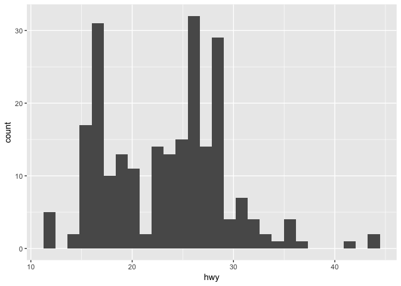

Sample R Notebook
================
Christopher Prener, Ph.D.
(January 14, 2018)

Introduction
------------

This R Notebook models the submission process for assignments in all of my `R` based courses ([SOC 4930 & SOC 5050](https://slu-soc5050.github.io) and [SOC 4650 & SOC 5650](https://slu-soc5650.github.io)). Make sure your notebooks are formatted like this one before you submit your work!

Project Set Up
--------------

Your notebook should begin with an introduction and then a "Project Set Up" section that includes the following code chunk:

``` r
knitr::opts_knit$set(root.dir = here::here())
```

Since our notebook resides in a subdirectory of the R project called `doc`, all relative paths to folders as in the `import("data/sampleData.csv")` are assumed to subdirectories of `doc`. This, of course, is not the case. Rather, we want our notebook to assume that relative paths of the folder with the R project file in it. The `knitr` and `here` package functions in the `setup` chunk work together to make sure that your notebook is compatible with the [project directory structure](https://chris-prener.github.io/SSDSBook/organizing-projects.html) we'll be using this semester.

General Notebook Structure
--------------------------

Up above the introduction is a [`YAML`](https://en.wikipedia.org/wiki/YAML) header that contains, by default, fields for `title` and `output`. Make sure you change the `output` from only saying `html_notebook` to also including `github_document` for each assignment. Both output types should be noted as `default`. Also be sure to add in and fill out the `author` and `date` fields. The `date` field function can be inserted into every document without change. When your notebook is "knit", it will always insert the current date.

I recommend using second level headings (`##`) for major sections, such as the different parts of each assignment. For each question, use a third level heading (`###`).

Question responses show follow a general "literate programming" pattern below each heading where you:

1.  Describe how the code addresses the question
2.  Execute the code in a code chunk, which should be named to keep your notebook's output organized and easy to look through if necessary
3.  Provide a written interpretation of the results

Your narrative text (1 and 3) should be written in full sentances.

Dependencies
------------

Your notebooks should always have a clearly organized dependencies section after the project set up code chunk. Be sure to include all of the packages that your document requires. This document requires the following packages:

``` r
library(dplyr)    # data wrangling
```

    ## 
    ## Attaching package: 'dplyr'

    ## The following objects are masked from 'package:stats':
    ## 
    ##     filter, lag

    ## The following objects are masked from 'package:base':
    ## 
    ##     intersect, setdiff, setequal, union

``` r
library(ggplot2)  # plotting

library(skimr)    # descriptive statistics
```

    ## 
    ## Attaching package: 'skimr'

    ## The following objects are masked from 'package:dplyr':
    ## 
    ##     contains, ends_with, everything, matches, num_range, one_of,
    ##     starts_with

I recommend adding a note next to each package that specifies why you are including it. This will help you in the long run, but making sure you have a clear sense of what each package does and helping build "muscle memory" of these functions by typing it out repeatedly. I also recommend grouping packages by type. Above, the two `tidyverse` packages are placed in the code chunk together.

Part 1
------

### Question 1

When you execute code within the notebook, the results appear beneath the code. Try executing this chunk by clicking the *Run* button within the chunk or by placing your cursor inside it and pressing *Cmd+Shift+Enter*.

``` r
ggplot(data = mpg, mapping = aes(hwy)) +
  geom_histogram(bins = 28)
```



Add a new chunk by clicking the *Insert Chunk* button on the toolbar or by pressing *Cmd+Option+I* (on an Apple computer).

If questions ask you to create "publication ready" plots, make sure you save them to the results directory of your assignment's project:

``` r
plot <- ggplot(data = mpg, mapping = aes(hwy)) +
          geom_histogram(bins = 28) +
          labs(
            title = "Histogram of Highway Fuel Efficiency",
            xlab = "highway fuel efficiency (miles per gallon)"
          )
ggsave("results/q1.png", plot)
```

    ## Saving 7 x 5 in image

### Question 2

Question two asks for descritive statistics, which we can obtain using the `skimr()` function:

``` r
skim(mpg, hwy, cty)
```

    ## Skim summary statistics
    ##  n obs: 234 
    ##  n variables: 11 
    ## 
    ## Variable type: integer 
    ##  variable missing complete   n  mean   sd p0 p25 median p75 p100     hist
    ##       cty       0      234 234 16.86 4.26  9  14     17  19   35 ▅▇▇▇▁▁▁▁
    ##       hwy       0      234 234 23.44 5.95 12  18     24  27   44 ▃▇▃▇▅▁▁▁

The average highway fuel efficiency for the vehicles in the sample is 23.44 miles per gallon while the average city fueld efficiency is only 16.86 miles per gallon.
